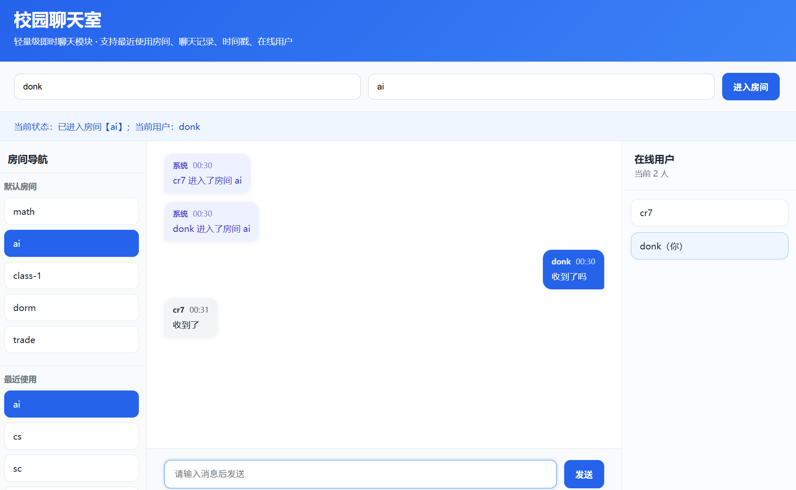
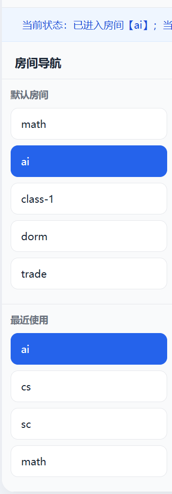

# 校园聊天室系统

一个基于 Flask + Socket.IO 实现的轻量级即时聊天系统，支持多房间聊天、在线用户列表、聊天记录、时间戳展示及最近使用房间管理，并已部署到公网。

---

## 在线体验

https://chat-system-r9tp.onrender.com

---

## 功能特点

- 多房间聊天（支持无限房间）
- 实时通信（WebSocket）
- 在线用户列表
- 聊天记录（最近100条）
- 时间戳
- 气泡聊天 UI
- 系统消息
- 房间切换
- 最近使用房间

---

## 项目截图

### 主界面

### 多人聊天

### 最近使用房间

