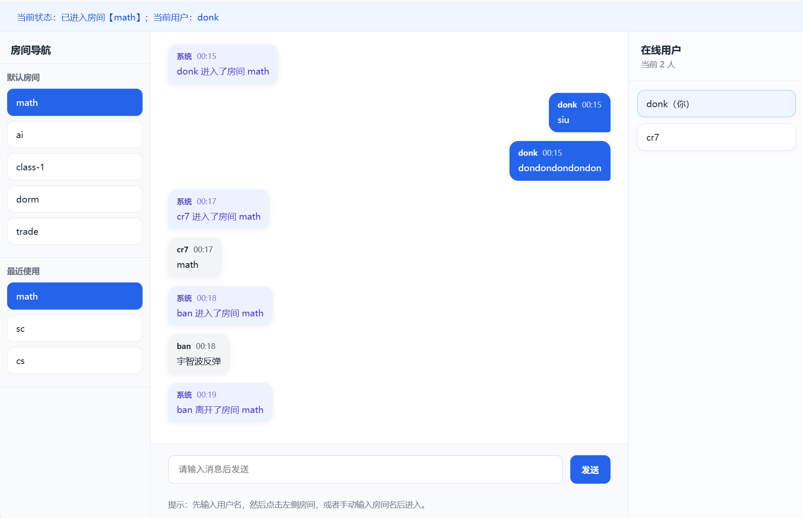

# 🧠 AI Chat Room（校园聊天室 + AI助手）

一个基于 **Flask + Socket.IO + DeepSeek API** 的实时聊天系统，支持多房间聊天，并集成 AI 助手能力。

---

## ✨ 项目功能

### 💬 聊天系统

* 用户注册 / 登录
* 多房间聊天（支持自由创建房间）
* 实时消息同步（WebSocket）
* 在线用户列表
* 聊天记录持久化（SQLite）
* 最近使用房间记录

---

### 🤖 AI助手（核心亮点）

* 集成 DeepSeek 大模型 API
* 支持 AI 开关（可手动控制是否启用）
* 只有输入 `@ai` 才会触发 AI 回复
* 支持 `@AI / @ai / @Ai`（大小写兼容）
* AI 消息独立样式展示
* AI 可用于：

  * 问答
  * 学习辅助
  * 聊天互动

---

## 🛠 技术栈

* **Backend**：Flask + Flask-SocketIO
* **Frontend**：HTML + CSS + JavaScript
* **Database**：SQLite
* **AI模型**：DeepSeek API
* **通信方式**：WebSocket

---

## 🚀 启动方式

```bash
pip install -r requirements.txt
python app.py
```

打开浏览器：

```
http://127.0.0.1:5000
```

---

## 🧪 AI使用方式

1️⃣ 勾选 “开启AI”
2️⃣ 在聊天框输入：

```
@ai 你的问题
```

示例：

```
@ai 什么是API？
```

---

## 📸 项目截图



---

## 📌 项目说明

本项目为学习 **全栈开发 + AI接入** 的实践项目，重点实现：

* 实时聊天系统（Socket.IO）
* 用户与房间管理
* AI能力集成（DeepSeek）

---

## 💡 后续可扩展

* AI上下文记忆（连续对话）
* @用户提醒
* 表情 / 图片消息
* 聊天记录分页
* UI优化（类微信界面）

---


